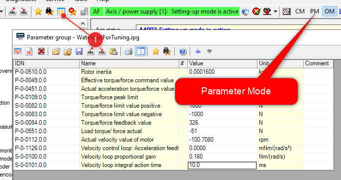

<h1 align="left">
   
  
   
  HEI-Vs Engineering School - Industrial Automation Base
   
</h1>

Cours AutB

Author: [Cédric Lenoir](mailto:cedric.lenoir@hevs.ch)

# LAB 05 Mise en service d'un axe électrique avec une vis à bille.

# Objectif
-   Comprendre les principaux éléments d'une commande d'axe électrique destinée à être reliée à un PLC.

# Notes d'écriture

La majorité des commandes d'axe électrique que l'on trouve actuellement sur le marché sont basés sur une structure similaire.

Même si la plupart des éléments que l'on retouve sur ce genre de commande seront vus dans d'autres cours,

-   Commande avancée.
-   Moteurs électriques.
-   Electronique de puissance.

Les produits commerciaux sont développés afin de permettre à un technicien de mettre en service un système le plus rapidement possible sans les bases théoriques qui seraient nécessaires à l'écriture d'une fonction de transfert complexe et le calcul de ses pôles, mais aussi sans connaître les principes d'une commande PWM.

Il est à noter aussi, que souvent l'ensemble des paramètres qui seraient nécessaires aux calculs théoriques ne sont pas disponibles ou doivent être estimés avec des méthodes empiriques.

Quelques paramètres qui sont souvent manquant pour permettre le calcul précis des paramètres d'une fonction de transfert:

-   frottements,
-   vibrations,
-   masses en mouvement.

> On notera toutefois que dans de nombreux cas, si des paramètres précis, comme les masses en mouvement, sont disponibles, ils permettent d'arriver plus rapidement à un résultat de bonne qualité. 

# Contenu

# Raw text from a base word document / to be completed with images.

## Limitation
On reste dans le contexte de l’industrie des machines, ou robotique. Pour un asservissement en position, on utilise majoritairement des moteurs synchrones, Permanent-magnet synchronous motor.
L’immense majorité des moteurs installés dans l’industrie en Valais sont des moteurs asynchrones dans des fonctionnement en vitesse, pompes, brasseurs. La gamme de système d’entrainement que nous utilisons dans nos laboratoires permettent aussi de piloter des moteurs asynchrones, mais seront probablement un peu cher comparativement à de simples variateurs de fréquence qui permettraient de faire le même travail.
## Mécaniquement
Deux catégories de moteur :
###	Linéaire.
- Avantage : dynamique, précis, peu de frottement, pas de jeu mécanique.
- Inconvénient : Cher, dans de nombreux cas, codeur indépendant de la mécanique, mise en service et intégration mécanique plus complexe.
Exemple : Etel, Linmot, Jennyscience.
Application : industrie des machines en général.
###	Rotatif.
Tous les cas où un moteur linéaire ne se justifie pas.

# Tension de fonctionnement
La majorité des moteurs synchrones utilisés dans l’industrie sont conçus pour fonctionner avec un simple redresseur AC/DC, ce qui donne pour une alimentation triphasée de 3 x 400 [Vac] environ 600 [Vdc] pour une alimentation non-régulée puis un convertisseur PWM pour générer les 3 phases du moteur.

Dans le laboratoire, on va faire.

# Connect

Se connecter au drive avec USB-C, utiliser l’axe X.
Si possible en utilisant son propre PC pour garder le PC labo libre.
 
<figure>
    
    <figcaption>Connection to drive with USB-C</figcaption>
</figure>

# Backup
Sauvegarder les paramètres actuels pour pouvoir les restaurer si nécessaire.
 
<figure>
    
    <figcaption>Save a backup of drive parameters to restore them if needed</figcaption>
</figure>

Les paramètres sont numérotés selon le sysème [Sercos](https://www.sercos.org).
Une multitude de paramètres sont accessibles en Realtime ou Non Realtime, en lecture ou en écriture. Certains paramètres ne peuvent être modifiés que quand le moteur est hors couple, voir même quand le drive est en mode Paramter.

- Backup parameters pour les paramètres de configuration.
- All parameters, archive absolument tous les paramètres. Ceci est utile pour faire un diagnostic, ou dans le cadre d'un cours pour présenter un axe uniquement sous forme de paramètres.

Il est conseillé, si possible, de passer en mode Parameter, avant de restaurer un set de paramètres.

<figure>
    
    <figcaption>Set Parameter Mode, only if power is off</figcaption>
</figure>

# Scaling
Change Scaling to Force, it will help to interpret measures during the lab.
<figure>
    
    <figcaption>Change scaling to force</figcaption>
</figure>
 
Parcourir la liste des fonctions : 20 minutes
Les paramètres du moteur, à vérifier à partir du Data Sheet MS2N04-D0BQN-CMSH0-NNNNE-NN
Noter la valeur manquante : Rated Motor Speed 3320 rpm

Noter que avec les moteur MS2N le drive corrige le Torque constant, qui n’est que partiellement constant, en fonction de la température !

# Piloter le moteur en mode manuel

# Trace data
Tracer une courbe classique Position, vitesse, accélération ou torque et erreur de poursuite. 20 minutes.

# Mesurer la force nécessaire a faible vitesse constante
	Comparer avec les spécifications du moteur
# Mesurer la force nécessaire pour vaincre le frottement statique.

# Estimer la masse en mouvement à l’aide de l’auto-tuning.

# Faire un tuning manuel est le comparer avec l’auto-tuning.

> Attention, feed-forward ; P-0-1126.0.0 à 0 !

> Conditions de départ :
- S-0-0100 = 1000 * l’inertie du moteur = 1000 * P-0-0510.
- S-0-0101 = 0 [ms] sans intégrateur
- P-0-0510 = 0.0001600

- Donc 0.16

Avec mon essai S-0-0100, commence à siffler vers 0.5, je mets 0.25
Je passe S-0-0101 à 10 ms pour commencer, siffle vers 0.6, je fixe à 1.2
Ensuite, je trace.
 
Les valeurs à afficher sur la fenêtre de paramètres
On peut aussi importer cette liste, voir WatchListForTuning.ipg ou la sauver.
 
# Visualise your data
 
Tracer les courbes sur 4 secondes pour :
S-0-0084	Force
S-0-0051	Position
S-0-0040	Vitesse
S-0-0347	Erreur de vitesse

 
Start et automatic scaling quand le signal est disponible
 
Commenter le graph
Mesure de vitesse.
 
 
Position
Vérifier ce qui se passe en mode position avec S-0-0104 = 1
 
Passer en mode positionning
 
Tracer cette fois l’erreur de poursuite S-0-0189

Maximiser l’affichage de l’erreur de poursuite
 

Comparer avec l’auto-tuning
 
Configuré sans feed-forward et sans filtre.

 
 
Afficher les résultats et commenter

Comparer Load Inertia : 0.0003421 avec celle du moteur 0.0001600
Votre commentaire…
Tracer à nouveau et comparer
Essayer avec Feed-Forward et comparer
Mon résultat avec Auto-tuning
 
Fin du Tuning
Mesure du frottement dynamique
Utiliser le mode vitesse, mais sur +- 50 mm pour faire cette mesure, augmenter le temps de mesure sur la trace
Faire des mesures à 600 mm/min
Puis 1200, 1800 et 2400…6000 (soit 100 mm/s)
Utiliser click droit pour visualiser les données :
 
Note : j’ai 328 N à 600
386 à 1200	
430 à 1800
462 à 2400
485 à 3000
554 à 6000
Mesurer le courant du moteur à 6000 et à partir du courant nominal estimer la charge du moteur.
Mesurer la température du moteur.
Aller chatouller les limites de couple du drive
Frottement dynamique
Passer en mode couple et prudemment estimer la force minimale pour commencer à bouger le moteur.
 

En finalité
Préparer un mouvement sur +/2 50 mm avec une vitesse de 600 mm.
Proposer votre tunning idéal, le justifier et le commenter.
Ne pas quitter la salle avant le feu vert d’un prof ou assistant qui puisse vérifier que votre tuning permet à l’axe de fonctionner correctement.

# Ne pas quitter la salle avant d'avoir restauré les paramètres !
