<h1 align="left">
   
  
   
  HEI-Vs Engineering School - Industrial Automation Base
   
</h1>

Cours AutB

Author: [Cédric Lenoir](mailto:cedric.lenoir@hevs.ch)

# LAB 05 
## Mise en service d'un axe électrique avec une vis à bille.

# Objectif
-   Comprendre les principaux éléments d'une commande d'axe électrique destinée à être reliée à un PLC.

# Généralités

La majorité des commandes d'axe électrique que l'on trouve actuellement sur le marché sont basés sur une structure similaire.

Même si la plupart des éléments que l'on trouve sur ce genre de commande seront vus dans d'autres cours,

-   Commande avancée.
-   Moteurs électriques.
-   Electronique de puissance.

Les produits commerciaux sont développés afin de permettre à un technicien de mettre en service un système le plus rapidement possible sans les bases théoriques qui seraient nécessaires à l'écriture d'une fonction de transfert complexe et le calcul de ses pôles, mais aussi sans connaître les principes d'une commande PWM.

Souvent l'ensemble des paramètres qui seraient nécessaires aux calculs théoriques ne sont pas disponibles ou doivent être estimés avec des méthodes empiriques.

## Méthode de Ziegler-Nichols
John G. Ziegler et Nathaniel B. Nichols ont développé une méthode empirique pour déterminer les paramètres d'un régulateur PID de manière empirique qui consiste au départ à déterminer un point d'oscillation en boucle fermée.

> la méthode de Ziegler-Nichols n'est pas toujours applicable et peut même s'avérer **dangereuse** sur des systèmes de forte puissance.

Quelques paramètres qui sont souvent manquant pour permettre le calcul précis des paramètres d'une fonction de transfert:

-   frottements,
-   vibrations,
-   masses en mouvement.

> Dans de nombreux cas, si des paramètres précis, comme **les masses en mouvement**, sont disponibles, ils permettent d'arriver plus rapidement à un résultat de bonne qualité.

> On gardera en tête qu'il n'existe pas de paramètres uniques pour un même système mécanique. Ces paramètres sont parfois à adapter en fonction du type de trajectoire ou de type de contrôle pour un même axe.

**Exemple:** Pour une machine de fraisage, un ensemble de paramètres bien adaptés pour un suivi en position pendant la phase d'usinage à faible vitesse ne sera pas optimal lorsque que le même axe devra effectuer un mouvement rapide pour une phase de changement d'outil.

# Présentation initiale
Ce travail de laboratoire est précédé d'une phase de présentation des différents paramètres pour la mise en service d'un axe électrique.

Cette présentation inclut:
## Power Supply
Permet de vérifier l'alimentation en puissance de l'axe électrique. Si nécessaire, de la configurer.
<figure>
    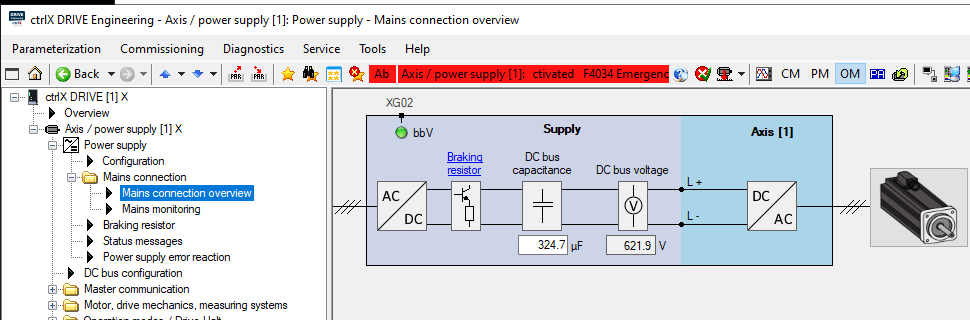
    <figcaption>Power Supply Mains connection overview</figcaption>
</figure>

# Master Communication
Ici, on configure la communication du drive avec le PLC, ici, via EtherCAT. Dans notre cas, la communication est interne au hardware de l'axe X, puisque celui-ci intègre le PLC dans son processeur.
<figure>
    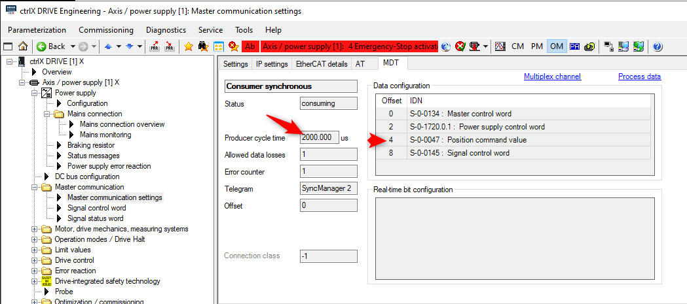
    <figcaption>Cycle time and registers sent to the drive from PLC</figcaption>
</figure>

# Motor Drive, mechanics and measuring system.
Configuration du moteur, du codeur et de la mécanique.

Cette liste de paramètres est en général suffisante pour que le drive puisse piloter un moteur
<figure>
    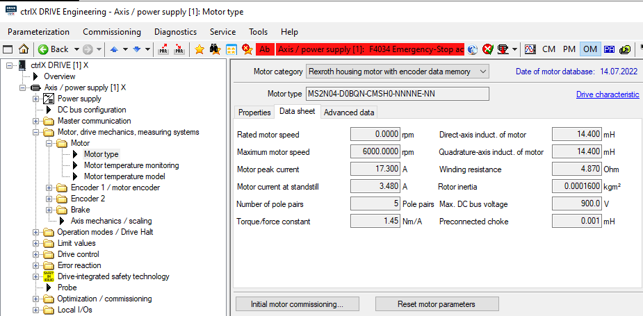
    <figcaption>Motor parameters</figcaption>
</figure>

*Noter la valeur manquante : Rated Motor Speed 3320 rpm.*

Le model de température ne pose en principe pas de problème pour un moteur rotatif intégré. Il devra être très finement configuré pour des moteurs linéaires dont la constante de temps thermique dépend d'une mécanique spécifique. 
<figure>
    
    <figcaption>Temperature model</figcaption>
</figure>

Dans notre cas, la configuration est inutile, puisque le type de codeur numérique est automatiquement reconnu au démarrage du drive.

Ce type de codeur mémorise aussi les paramètres du moteur qu'il mesure et sont transférés au drive au démarrage.
<figure>
    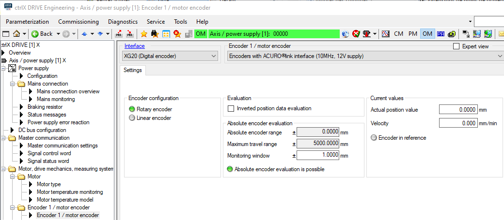
    <figcaption>Motor encoder configuration</figcaption>
</figure>

Cette configuration permet, entre autres, au drive de convertir les informations du codeur en position le long de la vis à bille.
<figure>
    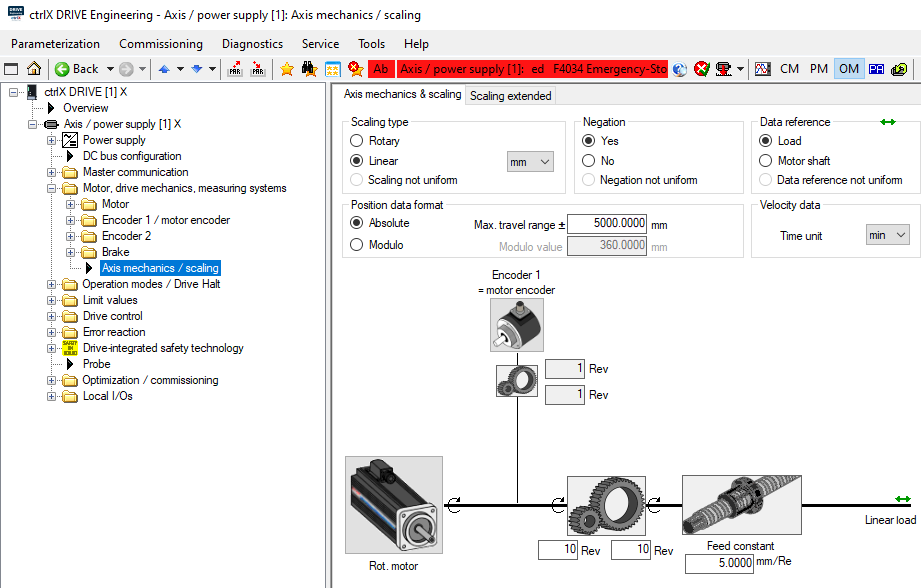
    <figcaption>Axis mechanic configuration</figcaption>
</figure>

## Operation modes
Avec EtherCAT, l'axe est piloté en mode position, même quand nous utilisons un bloc fonctionnel du type MC_MoveVelocity.
Ce type de fonctionnement reste acceptable pour des vitesses telles que celle de notre moteur, mais insuffisant pour une broche d'usinage à haute vitesse qui tournerai 10 fois plus vite.
<figure>
    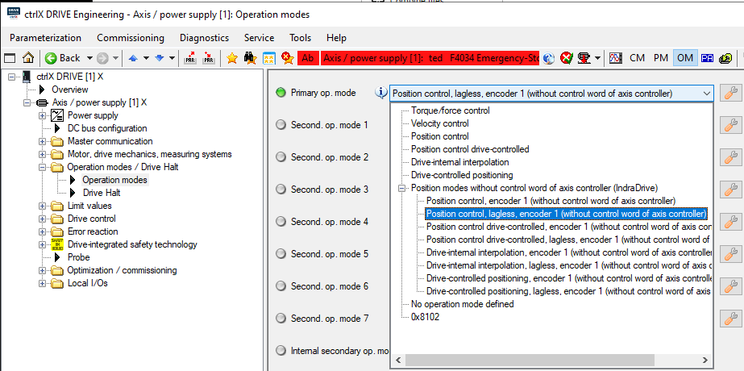
    <figcaption>Operation mode, position, velocity, torque and so on.</figcaption>
</figure>

## Limit values
Permet de protéger le processus, la mécanique, puis le moteur.

Ci-dessous, les valeurs limites fournies pour les axes du laboratoire d'automation de la HES-SO Valais/Wallis.

> L'installation d'interrupteurs de fin de course mécaniques ne rendrait pas obligatoirement le système plus robuste, puisque ceux-ci, tout comme les limites de position internes sont paramétrables.
<figure>
    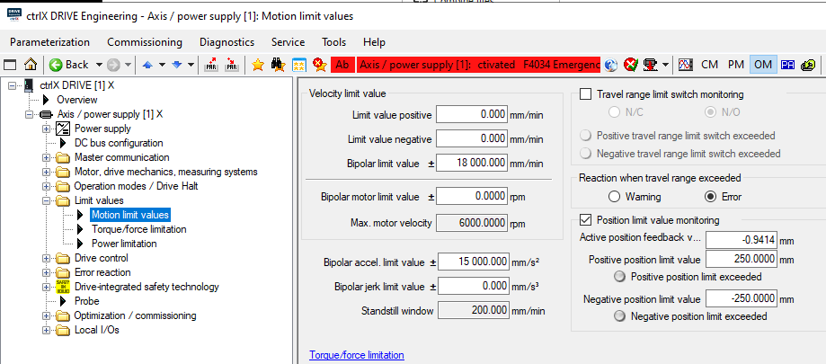
    <figcaption>Position and velocity limits</figcaption>
</figure>

|Axe |Smax [mm]|u[mm/U]    |Vmax[m/s]   |amax [m/s2]   |Mmax[Nm] | d  |i   |
|----|---------|-----------|------------|--------------|---------|----|----|
|x   |565      |5.0        |0.3         |15            |8.22     |ccw |1   |
|y   |350      |5.0        |0.38        |15            |6.76     |ccw |1   |
|z   |320      |5.0        |0.57        |15            |2.39     |cw  |1   |

Noter ci-dessous, que la limite de couple est une relation directe entre le courant maximal admissible et la constante de couple du moteur [Nm/A].
<figure>
    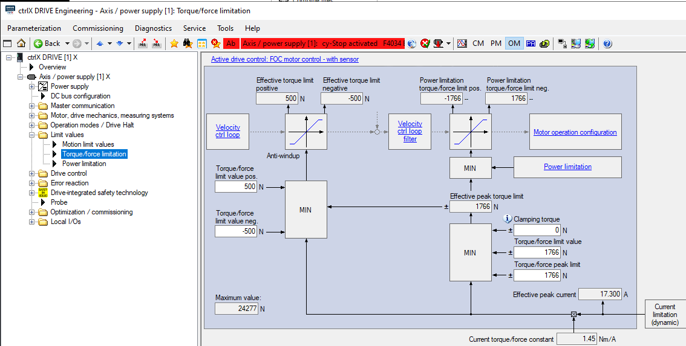
    <figcaption>Torque/Force limits</figcaption>
</figure>

> Pour le labo, modifier les valeurs Force Limit positives ``S-0-0082`` et négatives ``S-0-0083`` à +1500 [N] et -1500 [S].

## Drive Control

Les paramètres du régulateur de courant sont estimés par le drive en fonction des paramètres électriques du moteur. Sauf très rares exceptions, on ne modifiera jamais les paramètres de ce régulateur.
<figure>
    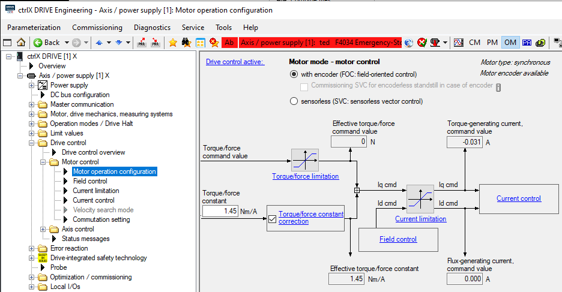
    <figcaption>Motor operation and configuration</figcaption>
</figure>

Cette méthode sert à déterminer la position du codeur relative aux aimants dans le cas où cette information n'aurait pas pu être calibrée par le fournisseur du moteur. En principe inutile pour un moteur rotatif, souvent indispensable pour l'utilisation d'un moteur linéaire avec une mécanique *faite maison*.
<figure>
    
    <figcaption>Commuation setting if position of encoder relative to magnets is unknown at startup</figcaption>
</figure>

Le principal travail de l'automaticien consiste à trouver les bons paramètres P et I du régulateur de vitesse.

Le paramètre **acceleration feedforward** du régulateur de vitesse n'est utile que si l'axe est piloté en mode vitesse. On se référa à l'explication de ce paramètre pour le régulateur de position.

<figure>
    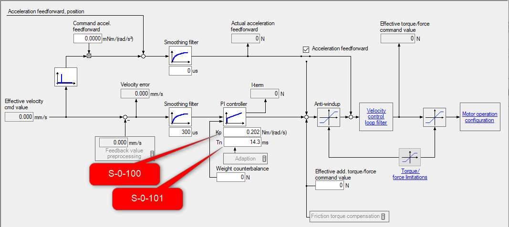
    <figcaption>Propartional gain and integration time of the velocity controller</figcaption>
</figure>

On travaille en général uniquement sur le gain du régulateur, et celui-ci, dans la pratique, est souvent laissé à **1**.
<figure>
    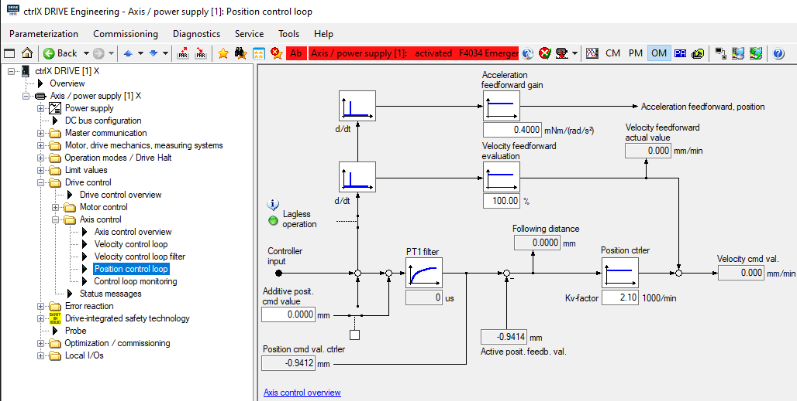
    <figcaption>Settings of the position controller</figcaption>
</figure>

### Feed Forward
On pourra adapter la réactivité du système en utilisant le paramètre de **Feed-Forward**. Sans rentrer dans les détails de la fonction de transfert qui n'est de toute façon pas au programme de l'ensemble de la classe, on peut expliquer intuitivement ce paramètre relativement simplement.

Ce que dit le documentation du fournisseur:

> The acceleration command value obtained from double differentiation of the position command value is multiplied with the content of ``S-0-0348`` and added to the torque/force command value at the velocity controller output.

> For optimum parameterization of the acceleration feedforward, the following parameters are specified in ``S-0-0348``

-   Total mass (motor + load) in kg (linear motor)
-   Total mass inertia (motor + load), in relation to the motor output shaft, in gm2 (rotary motor)

> The drive firmware automatically adjusts the unit and decimal places to the type of construction of the motor (rotary or linear) entered in ``P-0-4014, Motor type``.

-   rotary motor: $\ [mN*m / rad/s^2] → [g*m^2] $
-   Linear motor: $\ [mN / mm/s2 → kg] $

### Feed Forward, le principe
Il est probablement un peu plus simple d'expliquer le principe sur la base d'un moteur linéaire. Pour lequel la force est équivalente au courant multiplié par la constante de force. **Le principe du Feed Forward est d'ailleurs particulièrement efficace pour un moteur en prise directe sur la charge tel un moteur linéaire** ou un moteur couple.
Prenons les caractéristiques d'un moteur linéaire d'origine Etel.

<figure align="center">
    
    <figcaption>Etel ILF+ avec refroidissement à air forcé</figcaption>
</figure>

> Caractéristiques partielles d'un moteur ILF+03-030 / KA / Free Air Cooling

|    |                  |Unit   | ILF+03-030 KA|
|----|------------------|-------|--------------|
|Fc  |Continuous Force  |N      | 21.5         |
|Ic  |Continuous Current|Arms   | 0.745        |
|Kt  |Force constant    |N/Arms | 29.5         |

$\ Fc \approx Ic * Kt $

$\ F = m*a = dv/dt$ ou $dp / {dt}^2 $

D'oû: $\ Ic * Kt \approx dv/dt$ ou $dp / {dt}^2  $
Si l'on divise le tout par la constant $\ Kt $, on obtient:

$$\ I = \dfrac{dp/{dt}^2}{Kt} $$

Le Feed Forward consiste à ajouter en entrée du régulateur de courant la deuxième dérivée de la variation de position de commande. Ainsi, pour chaque variation de la position, le régulateur de courant du moteur reçoit directement la variation de courant nécessaire pour modifier la position du moteur. C'est très efficace pour un suivi précis en position, par contre, ce système peut s'avérer *agressif* pour la mécanique si les différences de position au niveau de la trajectoire de commande ne sont pas correctement maitrisées. Nous verrons dans le cadre du dernir labo comment maitriser efficacement les variations de position d'une trajectoire.

> Idéalement, si le Feed Forward est correctement dimensionné, les régulateurs de position et de vitesse intermédiaires ne devraient servir qu'à corriger les perturbations liées au frottement et aux vibrations.

Dans le schéma ci-dessus, c'est la raison d'être du voyant **Lagless operation**. Fonctionnement sans décalage ou sans erreur de poursuite, l'erreur de poursuite étant la différence entre la position commandée et la position mesurée par le codeur.

## Error reaction

Il ne faut pas confondre ce signal avec les signaux STO mentionnés dans la fonction de sécurité. Ce signal donne une commande d'arrêt immédiat à l'axe.
<figure align="center">
    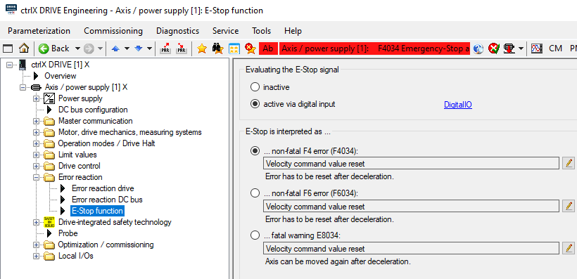
    <figcaption>Evaluating the E-Stop signal</figcaption>
</figure>

## Drive-integrated safety
Ces signaux sont utilisés pour garantir un arrêt sécurisé des axes via un circuit d'arrêt d'urgence selon ISO 13849-1
<figure align="center">
    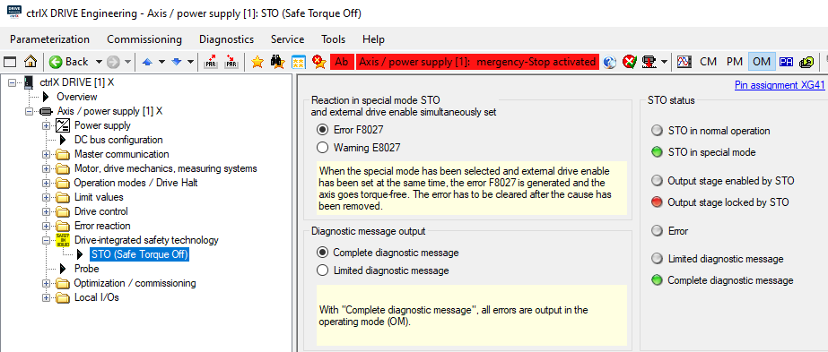
    <figcaption>Evaluating the E-Stop signal</figcaption>
</figure>

[Fin de l'introduction, passage à la phase active.](README_JobStart.md)
