<h1 align="left">
   
  
   
  HEI-Vs Engineering School - Industrial Automation Base
   
</h1>

Cours AutB

Author: [Cédric Lenoir](mailto:cedric.lenoir@hevs.ch)

# LAB 05 Inbetriebnahme einer elektrischen Achse mit Kugelumlaufspindel.

# Zielsetzung
- Verstehen Sie die Hauptelemente einer elektrischen Achssteuerung, die an eine SPS angeschlossen werden soll.

# Achtung: Aus diesem Anlass möchte ich einen schriftlichen Bericht für das nächste Labor!

# Allgemein

Die meisten derzeit auf dem Markt befindlichen elektrischen Achssteuerungen basieren auf einem ähnlichen Aufbau.

Auch wenn die meisten Elemente, die wir bei diesem Befehlstyp finden, in anderen Kursen zu sehen sind,

- Erweiterter Befehl.
-   Elektromotoren.
- Leistungselektronik.

Kommerzielle Produkte werden entwickelt, um es einem Techniker zu ermöglichen, ein System so schnell wie möglich in Betrieb zu nehmen, ohne über die theoretischen Grundlagen zu verfügen, die zum Schreiben einer komplexen Übertragungsfunktion und zur Berechnung ihrer Pole erforderlich wären, aber auch ohne die Prinzipien der PWM-Steuerung zu kennen.

Oft sind nicht alle Parameter verfügbar, die für theoretische Berechnungen notwendig wären, oder müssen mit empirischen Methoden geschätzt werden.

## Ziegler-Nichols-Methode
John G. Ziegler und Nathaniel B. Nichols entwickelten eine empirische Methode zur empirischen Bestimmung der Parameter eines PID-Reglers, bei der zunächst ein Oszillationspunkt im geschlossenen Regelkreis bestimmt wird.

> Die Ziegler-Nichols-Methode ist nicht immer anwendbar und kann bei Hochleistungssystemen sogar **gefährlich** sein.

Einige Parameter, die oft fehlen, um eine genaue Berechnung der Parameter einer Übertragungsfunktion zu ermöglichen:

- Reibung,
-   Vibes,
- Massen bewegen.

> Wenn präzise Parameter wie **bewegte Massen** vorliegen, ist es in vielen Fällen möglich, schneller ein qualitativ gutes Ergebnis zu erzielen.

> Wir werden bedenken, dass es für dasselbe mechanische System keine eindeutigen Parameter gibt. Diese Parameter müssen manchmal je nach Art der Flugbahn oder Art der Steuerung derselben Achse angepasst werden.

**Beispiel:** Für eine Fräsmaschine ist ein Satz von Parametern, die gut für die Positionsverfolgung während der Bearbeitungsphase mit niedriger Geschwindigkeit geeignet sind, nicht optimal, wenn dieselbe Achse für eine Bearbeitungsphase eine schnelle Bewegung ausführen muss.

# Erstpräsentation
Dieser Laborarbeit geht eine Phase der Präsentation der verschiedenen Parameter für die Inbetriebnahme einer elektrischen Achse voraus.

Diese Präsentation beinhaltet:
## Power Supply
Ermöglicht die Überprüfung der Stromversorgung der elektrischen Achse. Konfigurieren Sie es bei Bedarf.
<figure>
    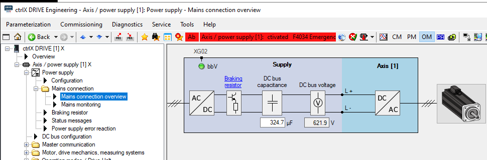
    <figcaption>Power Supply Mains connection overview</figcaption>
</figure>

# Master Communication
Hier konfigurieren wir die Kommunikation des Antriebs mit der SPS, hier über Ethercat. In unserem Fall erfolgt die Kommunikation innerhalb der X-Achsen-Hardware, da sie die SPS in ihren Prozessor integriert.
<figure>
    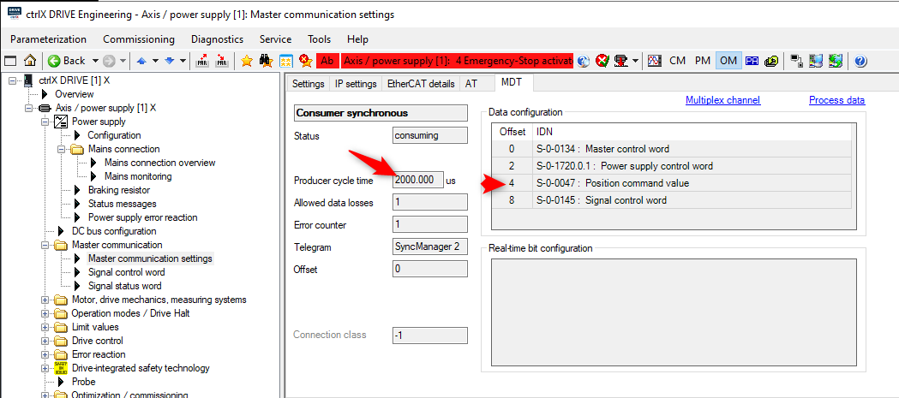
    <figcaption>Cycle time and registers sent to the drive from PLC</figcaption>
</figure>

# Motor Drive, mechanics and measuring system.
Konfiguration von Motor, Encoder und Mechanik.

Diese Parameterliste reicht im Allgemeinen aus, damit der Antrieb einen Motor steuern kann.
<figure>
    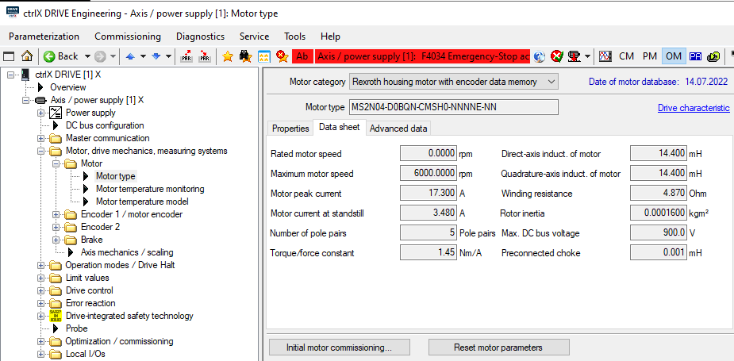
    <figcaption>Motor parameters</figcaption>
</figure>

*Beachten Sie den fehlenden Wert: Rated motor speed 3320 [rpm].*

Für einen integrierten Rotationsmotor stellt das Temperaturmodell grundsätzlich kein Problem dar. Für Linearmotoren, deren thermische Zeitkonstante von der spezifischen Mechanik abhängt, muss es sehr fein konfiguriert werden.
<figure>
    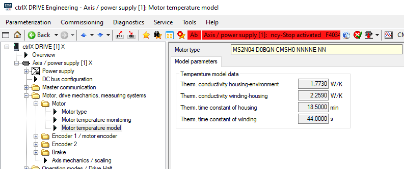
    <figcaption>Temperature model</figcaption>
</figure>

In unserem Fall erübrigt sich die Konfiguration, da der Typ des digitalen Gebers beim Starten des Antriebs automatisch erkannt wird.

Dieser Encodertyp speichert auch die Motorparameter, die er misst und beim Start an den Antrieb überträgt.
<figure>
    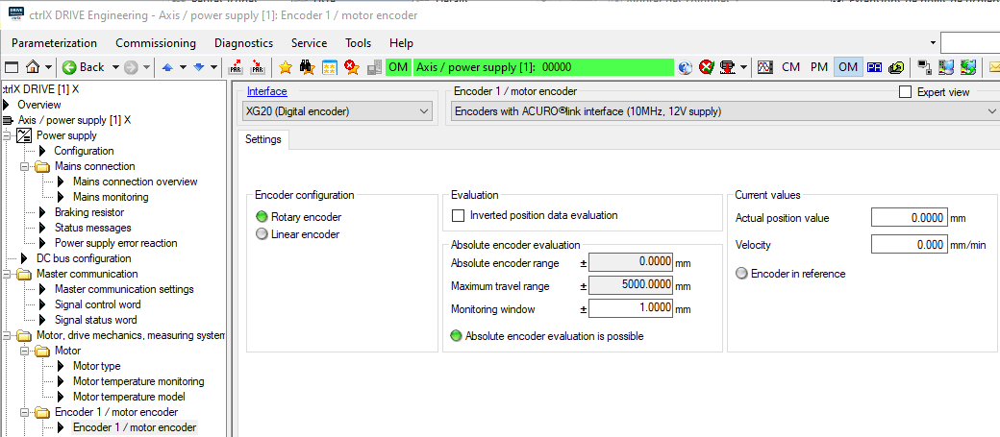
    <figcaption>Motor encoder configuration</figcaption>
</figure>

Diese Konfiguration ermöglicht es dem Antrieb unter anderem, Informationen vom Encoder in die Position entlang der Kugelumlaufspindel umzuwandeln.
<figure>
    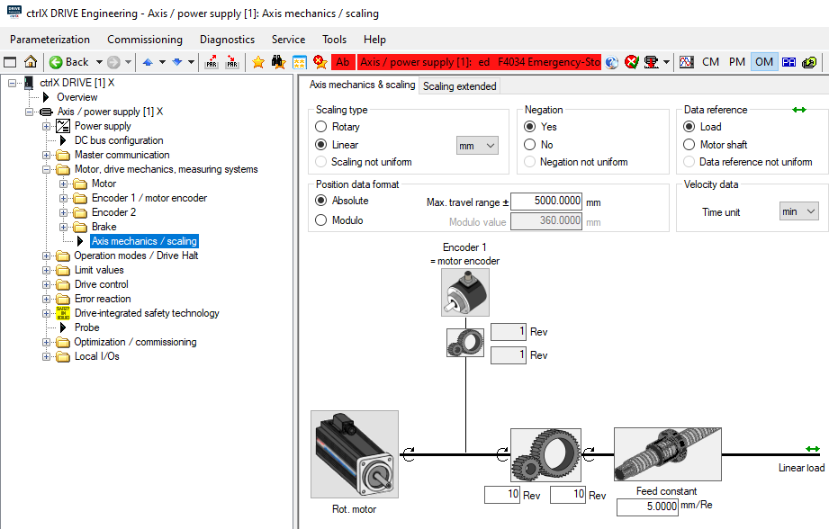
    <figcaption>Axis mechanic configuration</figcaption>
</figure>

## Operation modes
Bei Ethercat wird die Achse im Positionsmodus gesteuert, auch wenn wir einen Funktionsblock vom Typ MC_MoveVelocity verwenden.
Für Drehzahlen wie die unseres Motors bleibt diese Betriebsart akzeptabel, reicht aber für eine Hochgeschwindigkeits-Bearbeitungsspindel, die zehnmal schneller dreht, nicht aus.
<figure>
    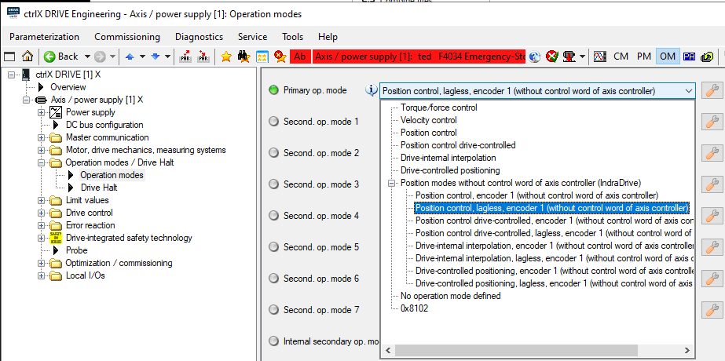
    <figcaption>Operation mode, position, velocity, torque and so on.</figcaption>
</figure>

## Limit values
Ermöglicht den Schutz des Prozesses, der Mechanik und dann des Motors.

Nachfolgend die für die Achsen des Automatisierungslabors der HES-SO Valais/Wallis vorgesehenen Grenzwerte.

> Der Einbau von mechanischen Endschaltern würde das System nicht unbedingt robuster machen, da diese ebenso wie die internen Positionsgrenzen konfigurierbar sind.
<figure>
    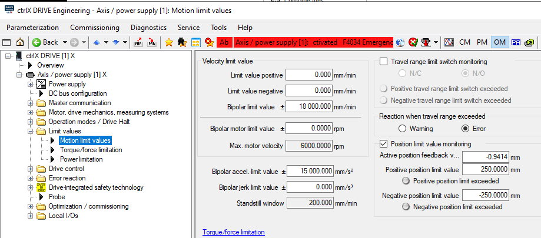
    <figcaption>Position and velocity limits</figcaption>
</figure>

|Axe |Smax [mm]|u[mm/U]    |Vmax[m/s]   |amax [m/s2]   |Mmax[Nm] | d  |i   |
|----|---------|-----------|------------|--------------|---------|----|----|
|x   |565      |5.0        |0.3         |15            |**8.22** |ccw |1   |
|y   |350      |5.0        |0.38        |15            |6.76     |ccw |1   |
|z   |320      |5.0        |0.57        |15            |2.39     |cw  |1   |

Beachten Sie weiter unten, dass die Drehmomentgrenze eine direkte Beziehung zwischen dem maximal zulässigen Strom und der Motordrehmomentkonstante [Nm/A] ist.

<figure>
    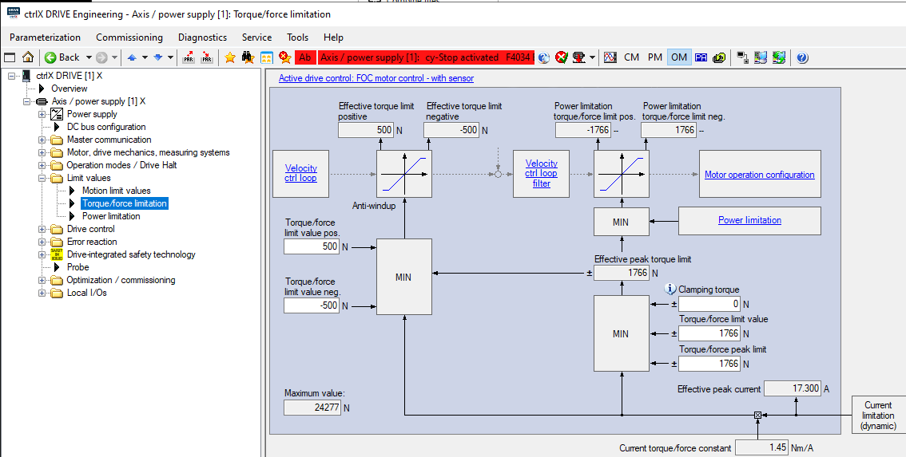
    <figcaption>Torque/Force limits</figcaption>
</figure>

> Ändern Sie für das Labor die positiven Kraftgrenzwerte ``S-0-0082`` und die negativen ``S-0-0083`` in +1500 [N] und -1500 [S].

## Drive Control

Die Parameter des Stromreglers werden vom Antrieb anhand der elektrischen Parameter des Motors geschätzt. Mit sehr seltenen Ausnahmen werden wir die Parameter dieses Reglers niemals ändern.
<figure>
    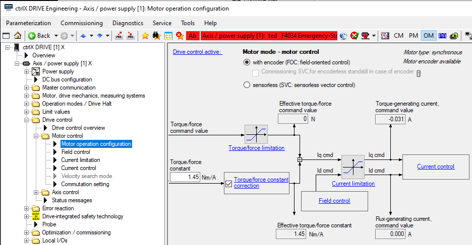
    <figcaption>Motor operation and configuration</figcaption>
</figure>

Diese Methode wird verwendet, um die Position des Encoders relativ zu den Magneten zu bestimmen, falls diese Informationen nicht vom Motorlieferanten kalibriert werden konnten. Im Prinzip unbrauchbar für einen Rotationsmotor, oft unerlässlich für den Einsatz eines Linearmotors mit *selbstgebauter* Mechanik.

<figure>
    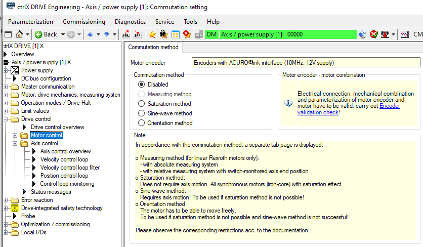
    <figcaption>Commuation setting if position of encoder relative to magnets is unknown at startup</figcaption>
</figure>

Die Hauptaufgabe des Automatisierungsingenieurs besteht darin, die richtigen P- und I-Parameter des Tempomaten zu finden
.
Der Parameter **Acceleration Feedforward** des Geschwindigkeitsreglers ist nur sinnvoll, wenn die Achse im Geschwindigkeitsmodus gefahren wird. Wir verweisen auf die Erläuterung dieses Parameters für den Positionsregler.

<figure>
    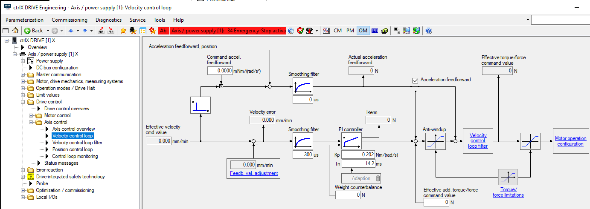
    <figcaption>Propartional gain and integration time of the velocity controller</figcaption>
</figure>

Wir arbeiten im Allgemeinen nur an der Verstärkung des Reglers, und diese bleibt in der Praxis oft bei **1**.

<figure>
    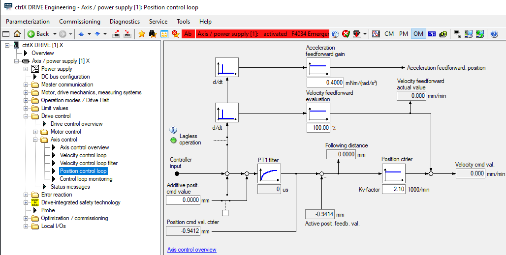
    <figcaption>Settings of the position controller</figcaption>
</figure>

### Feed Forward
Mit dem Parameter **Feed-Forward** können wir die Reaktionsfähigkeit des Systems anpassen. Ohne auf die Details der Übertragungsfunktion einzugehen, die ohnehin nicht im Programm der gesamten Klasse enthalten ist, können wir diesen Parameter intuitiv relativ einfach erklären.

Was in der Herstellerdokumentation steht:

> Der aus der doppelten Differenzierung des Lagesollwerts resultierende Beschleunigungssollwert wird mit dem Inhalt von „S-0-0348“ multipliziert und am Ausgang des Geschwindigkeitsreglers zum Drehmoment-/Kraftsollwert addiert.

> Zur optimalen Parametrierung der Beschleunigungsvorsteuerung sind in „S-0-0348“ folgende Parameter festgelegt

- Gesamtmasse (Motor + Last) in kg (Linearmotor)
- Gesamtmassenträgheit (Motor + Last), bezogen auf die Motorausgangswelle, in gm2 (Rotationsmotor)

> Die Antriebsfirmware passt die Einheit und die Nachkommastellen automatisch an die in „P-0-4014, Motortyp“ eingetragene Bauart des Motors (rotatorisch oder linear) an.

-   rotary motor: $\ [mN*m / rad/s^2] → [g*m^2] $
-   Linear motor: $\ [mN / mm/s2 → kg] $

### Feed Forward, das Prinzip
Etwas einfacher ist es wahrscheinlich, das Prinzip anhand eines Linearmotors zu erklären. Dabei entspricht die Kraft dem Strom multipliziert mit der Kraftkonstante. **Das Feed-Forward-Prinzip ist besonders effektiv für einen Motor, der direkt mit der Last verbunden ist, wie z. B. einen Linearmotor** oder einen Torquemotor.

Nehmen wir die Eigenschaften eines originalen Etel-Linearmotors.

<figure align="center">
    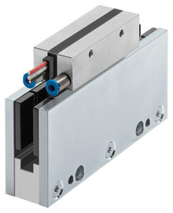
    <figcaption>Etel ILF+ mit forcierter Luftkühlung</figcaption>
</figure>

> Teileigenschaften eines ILF+03-030-Motors / KA / Free Air Cooling

|    |                  |Unit   | ILF+03-030 KA|
|----|------------------|-------|--------------|
|Fc  |Continuous Force  |N      | 21.5         |
|Ic  |Continuous Current|Arms   | 0.745        |
|Kt  |Force constant    |N/Arms | 29.5         |

$\ Fc \approx Ic * Kt $

$\ F = m*a = dv/dt$ ou $dp / {dt}^2 $

Wovon: $\ Ic * Kt \approx dv/dt$ ou $dp / {dt}^2  $
Wenn wir alles durch die Konstante $\ Kt $ dividieren, erhalten wir:

$$\ I = \dfrac{dp/{dt}^2}{Kt} $$

Feed Forward besteht aus der Addition der zweiten Ableitung der Regelpositionsänderung zum aktuellen Reglereingang. Somit erhält der Motorstromregler für jede Positionsänderung direkt die Stromänderung, die zur Änderung der Position des Motors erforderlich ist. Dies ist für eine präzise Positionsverfolgung sehr effektiv, jedoch kann sich dieses System als *aggressiv* für die Mechanik erweisen, wenn die Positionsunterschiede auf der Ebene der Steuertrajektorie nicht korrekt kontrolliert werden. Im letzten Labor werden wir sehen, wie man die Positionsschwankungen einer Flugbahn effektiv steuern kann.

> Idealerweise sollten die Zwischenpositions- und Geschwindigkeitsregler bei korrekter Dimensionierung des Feed Forward nur zur Korrektur von Störungen im Zusammenhang mit Reibung und Vibrationen verwendet werden.

Im obigen Diagramm ist dies der Zweck des Indikators **Lagless operation**. Betrieb ohne Offset oder Schleppfehler, wobei der Schleppfehler die Differenz zwischen der Sollposition und der vom Encoder gemessenen Position ist.

## Error reaction

Dieses Signal sollte nicht mit den in der Sicherheitsfunktion genannten STO-Signalen verwechselt werden. Dieses Signal gibt der Achse einen sofortigen Stoppbefehl.

<figure align="center">
    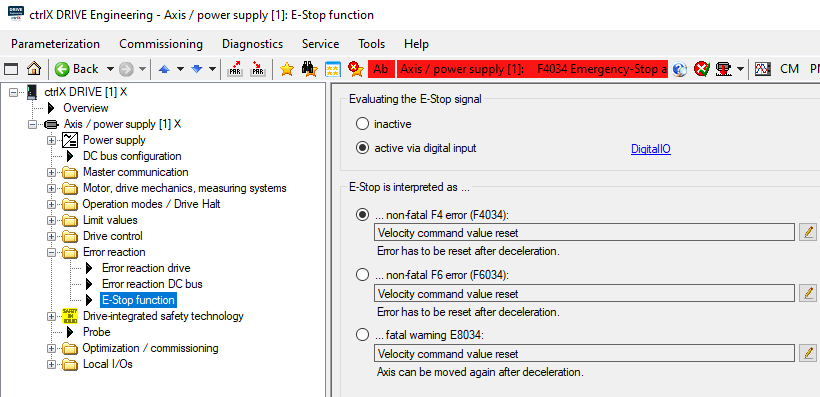
    <figcaption>Evaluating the E-Stop signal</figcaption>
</figure>

## Drive-integrated safety
Ces signaux sont utilisé pour garantir un arrêt sécurisé des axes via un circuit d'arrêt d'urgence selon ISO 13849-1.

<figure align="center">
    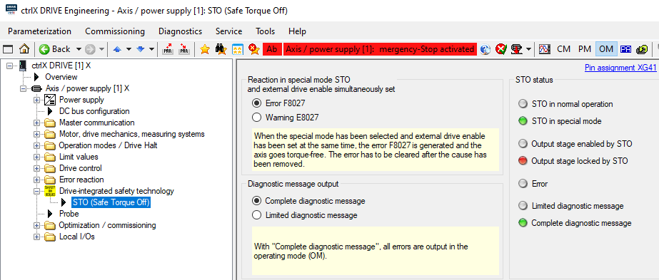
    <figcaption>Evaluating the E-Stop signal</figcaption>
</figure>

[Ende der Einführung, Übergang zur aktiven Phase.](README_JobStart_DE.md)
