<h1 align="left">
   
  
   
  HEI-Vs Engineering School - Industrial Automation Base
   
</h1>

Cours AutB

Author: [Cédric Lenoir](mailto:cedric.lenoir@hevs.ch)

# LAB 05 Mise en service d'un axe électrique avec une vis à bille.

Job start with:

# CtrlX Drive Engineering
Ce logiciel est conçu pour:
-   Visualiser et si nécessaire modifier les paramètres des axes électriques.
-   Visualier le comportement de l'axe à l'aide d'un oscilloscope intégré.
-   Piloter l'axe en mode manuel pour optimiser son comportement.
-   Lancer une procédure de **Auto-Tuning**.

<figure>
    
    <figcaption>Use CtrlX Drive Engineering</figcaption>
</figure>

# Connect

Se connecter au drive avec USB-C, utiliser l’axe X.
Si possible en utilisant son propre PC pour garder le PC labo libre.
 
<figure>
    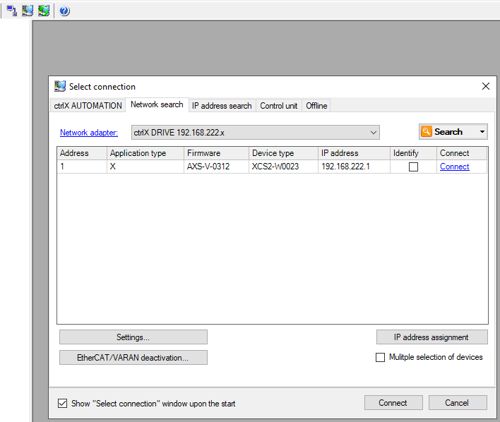
    <figcaption>Connection to drive with USB-C</figcaption>
</figure>

> Il est possible de se connecter de différentes manières.

# Backup
Sauvegarder les paramètres actuels pour pouvoir les restaurer si nécessaire.

Avant de sauvegarder les paramètres, il est préférable de passer en mode PM, Parameter Mode. Pour cela, le moteur ne doit pas être sous tension.

SelectParameterMode
<figure>
    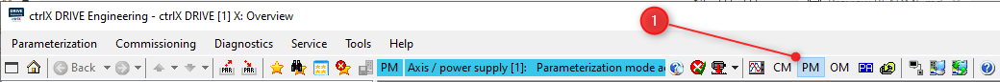
    <figcaption>Set Axis in PM, Parameter Mode</figcaption>
</figure>
 
<figure>
    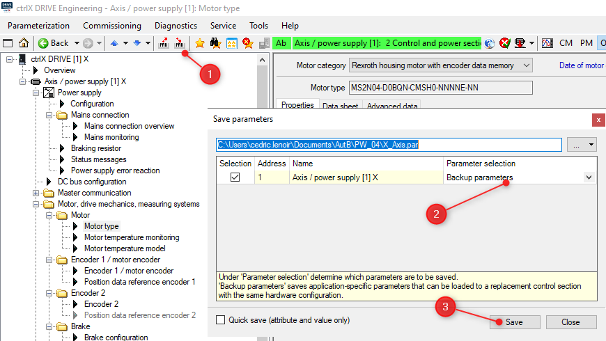
    <figcaption>Save a backup of drive parameters to restore them if needed</figcaption>
</figure>

Les paramètres sont numérotés selon le sysème [Sercos](https://www.sercos.org).
Une multitude de paramètres sont accessibles en Realtime ou Non Realtime, en lecture ou en écriture. Certains paramètres ne peuvent être modifiés que quand le moteur est hors couple, voir même quand le drive est en mode Paramter.

- **Backup parameter**s pour les paramètres de configuration.
- **All parameters**, archive absolument tous les paramètres. Ceci est utile pour faire un diagnostic, ou dans le cadre d'un cours pour présenter un axe uniquement sous forme de paramètres.

Après avec archivé les paramètres, restaurer le mode OM.

<figure>
    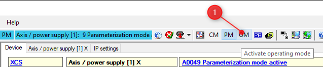
    <figcaption>Restore OM Operating Mode</figcaption>
</figure>

# Scaling
L'axe doit connaitres les paramètres mécaniques du système pour pouvoir convertir la position du codeur en unités qui conviennent à l'application.

Dans notre cas de figure, la position du codeur est convertie, entre autre, en mm pour la position linéaire de l'axe X.

<figure>
    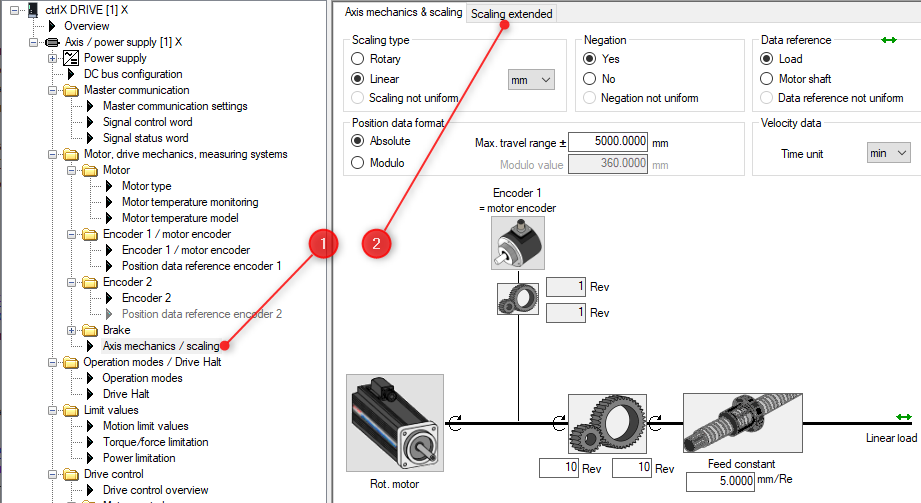
    <figcaption>Go to Axis Mechanical Scaling</figcaption>
</figure>

Pour faciliter l'interprétation des résultats, nous modifions un paramètre afin que le système convertisse le couple du moteur en Force pour la lecture de l'effort linéaire en sortie de la vis à bille.

<figure>
    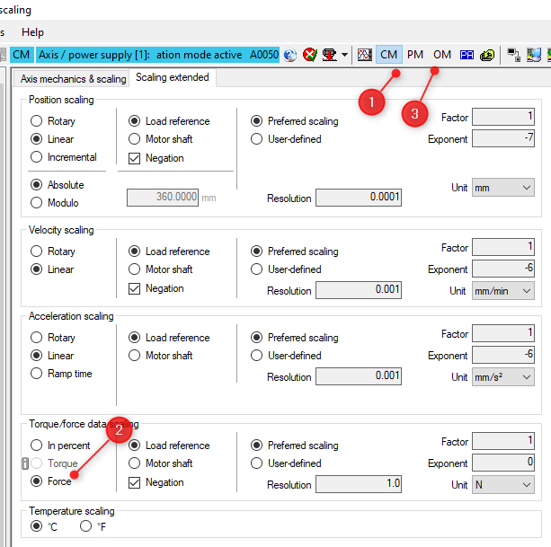
    <figcaption>Change scaling to force</figcaption>
</figure>

Il faut noter qu'un changement d'unité ne peut pas se faire sous n'importe quelle condition. L'axe doit être en mode **CM**, **Configuration Mode**, pour autoriser un changement d'unité.

<figure>
    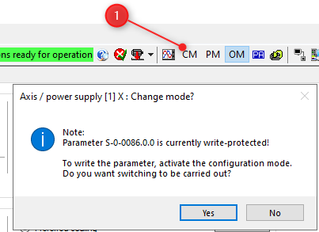
    <figcaption>You must be in Configuration Mode to modify a scaling parameter</figcaption>
</figure>

## Modification des limites
Le système ne sait pas convertir correctement les limites lors du changement d'unités de couple vers force.
Il faut modifier les limites de force, sous peine de ne pas réussir à utiliser l'axe !

<figure>
    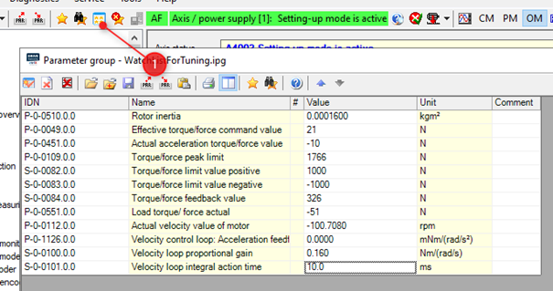
    <figcaption>Display some parameters used for this lab</figcaption>
</figure>

Vous pouvez sauver la liste des paramètres à afficher. Fichier de type ipg.
Vous pouvez aussi utiliser le fichier fournit avec les documents, voir: ``..\ctrlxDriveFiles\WatchListForTuning.ipg``.

Vous pouvez modifier les limites soit dans cette liste de paramètres, attention, il faut être en mode **PM**.
Soit aller dans la fenêtre des limites mentionnée en introduction.

### Les limites à modifier
-   ``P-0-0109.0.0 ``   :   1766
-   ``S-0-0082.0.0``    :   1000
-   ``S-0-0083.0.0``    :   1000

Calculer la force théorique maximale de la vis à bille. A cette valeur il faudrait multiplier le rendement de la vis à bille, **estimée entre 0.5 et 0.9**. A mettre dans votre rapport.

On connait les caractéristiques de la vis à bille.
|Axe |Smax [mm]|u[mm/U]    |Vmax[m/s]   |amax [m/s2]   |Mmax[Nm] | d  |i   |
|----|---------|-----------|------------|--------------|---------|----|----|
|x   |565      |5.0        |0.3         |15            |8.22     |ccw |1   |

# Piloter le moteur en mode manuel
<figure>
    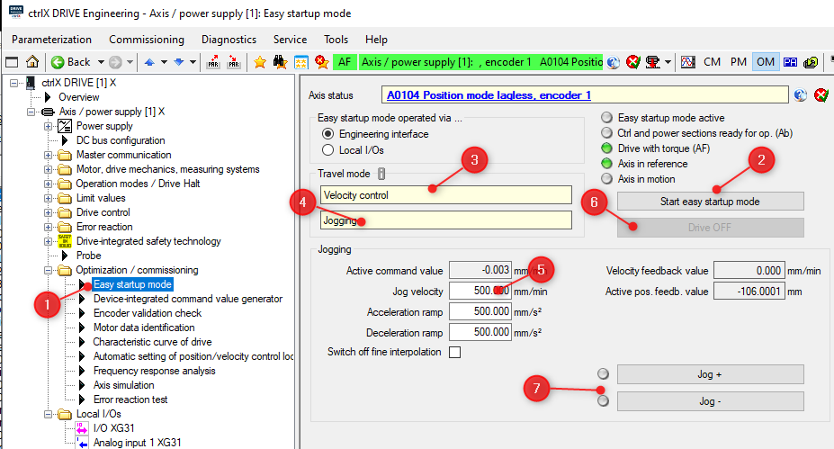
    <figcaption>You should be able to move your motor with that</figcaption>
</figure>

<figure>
    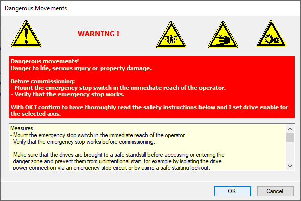
    <figcaption>Only for info, click OK</figcaption>
</figure>

<figure>
    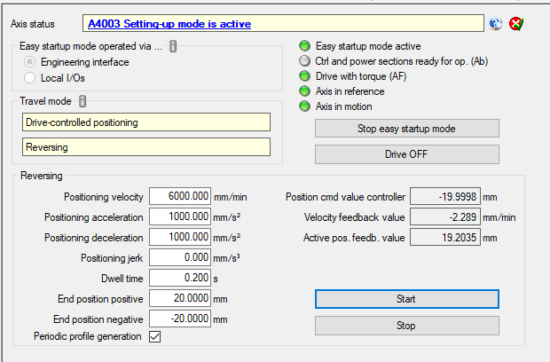
    <figcaption>Start your first motion in Drive Controlled positionning</figcaption>
</figure>

# Trace data
Tracer une courbe classique Position, vitesse, accélération ou torque et erreur de poursuite.
<figure>
    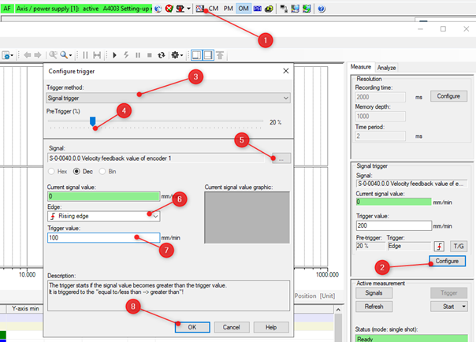
    <figcaption>Trace the motion of Easy Startup Mode</figcaption>
</figure>

## Paramètres à visualiser et commenter:
``S-0-0084``	Force
``S-0-0051``	Position
``S-0-0040``	Vitesse
``S-0-0189``	Erreur de poursuite

<figure>
    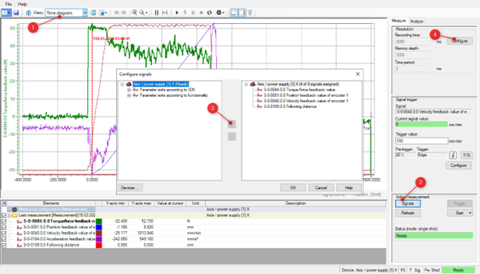
    <figcaption>Configure data to trace</figcaption>
</figure>

<figure>
    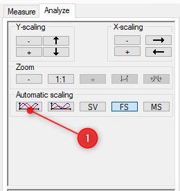
    <figcaption>Scale data</figcaption>
</figure>

# Faire un tuning manuel est le comparer avec l’auto-tuning.

<figure>
    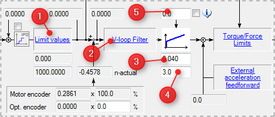
    <figcaption>Velocity controller</figcaption>
</figure>

1.	Limit Values : Permet de limiter la vitesse du moteur
2.	V-loop Filter : 2 ou 4 filtres paramétrables + 1 filtre passe-bas
3.	S-0-0100 : Composante P, proportionnelle du régulateur de vitesse.
4.	S-0-0101 : Composante I, intégrale du régulateur de vitesse.
5.	S-0-0163 : Compensation de poids, pour les axes verticaux

<figure>
    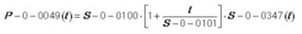
    <figcaption>Velocity controller transfer function</figcaption>
</figure>

## Procedure
### Réglage empirique
Basé sur la méthode Ziegler et Nichols

> Idéalement, faire tourner le moteur en mode vitesse à environ 20 rpm à l’aide du « Easy Startup Mode ». Si la mécanique ne le permet pas, travailler à vitesse nulle.

> Attention, feed-forward ; P-0-1126.0.0 à 0 !

### Gain S-0-0100
> Conditions de départ :
-   Régulateur de position S-0-0104 = 1
$$\ S-0-0100 = 1000 * l’inertie du moteur = 1000 * P-0-0510 $$
-   S-0-0101 = 0 [ms] sans intégrateur
-   P-0-0510 = 0.0001600

- Donc 0.16

Augmenter progressivement le gain jusqu’à ce que le système commence à vibrer.

En principe, la vibration est audible. Sinon, visualiser le signal S-0-0100 sur l’oscilloscope.

<figure>
    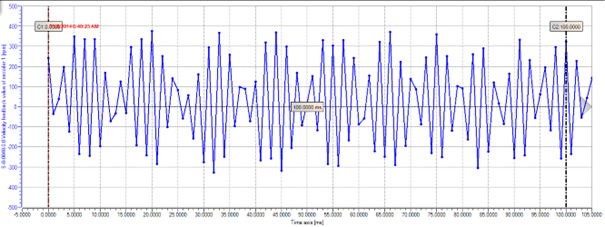
    <figcaption>Velocity controller vibration</figcaption>
</figure>

-   Diminuer le gain jusqu’à ce que la vibration cesse. C’est le gain critique.
-   Diviser le gain critique par 2.

#### Exemple :
-   Gain de départ : S-0-0100 = 1000 * P-0-0510 = 0.01
-   L’oscillation apparaît à 0.09 et disparait à 0.065. Le gain critique est de 0.065
-   S-0-0100 estimé à 0.065 / 2 = 0.0325

### Temps d’intégration S-0-0101
Diminuer progressivement le temps d’intégration S-0-0101 (en partant d’environ 100 ms) jusqu’à atteindre le point d’oscillation.
Augmenter le temps d’intégration jusqu’à faire cesser l’oscillation. La valeur obtenue est le temps critique.
Multiplier ensuite la valeur par 2 pour obtenir la valeur finale de S-0-0101.

#### Exemple :
Temps de départ : S-0-0101 = 100 ms
L’oscillation apparaît à 0.6 et disparait à 0.7. La valeur critique est de 0.07
S-0-0101 estimé à 0.7 * 2 = 1.4

### Visualisation avec l’oscilloscope
Ici, affichage du couple en rouge et de la vitesse en bleu.

<figure>
    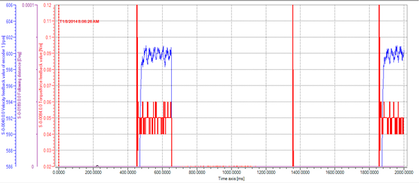
    <figcaption>Velocity controller example on the scope </figcaption>
</figure>

-   Les échelles sont ajustées manuellement pour visualiser sur le même tableau les deux valeurs pour une vitesse de 600 rpm.
-   On voit que la vitesse oscille de moins de 2 rpm < 0.5%
-   Le couple oscille à un incrément de la résolution
-   On obtient donc pour un moteur simple, un régulateur de vitesse stable.

## Visualise your data en mode **Velocity Control**,
 
Tracer les courbes sur 4 secondes pour :
-   ``S-0-0084``	Force
-   ``S-0-0051``	Position
-   ``S-0-0040``	Vitesse
-   ``S-0-0347``	Erreur de vitesse

Start et automatic scaling quand le signal est disponible
 
Commenter le graph

## Comparer avec l'auto tuning
Mémorisez vos valeurs de S-0-0100 et S-0-0101 et les comparer avec le tuning automatique.
<figure>
    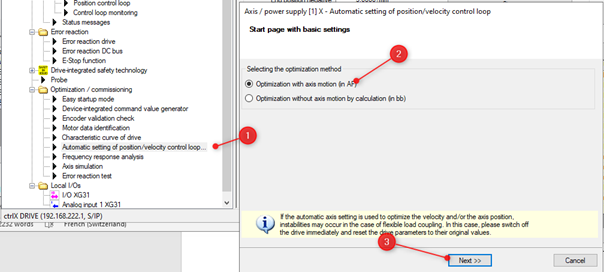
    <figcaption>Start Auto-Tuning </figcaption>
</figure>
 
Configuré sans feed-forward et sans filtre.
<figure>
    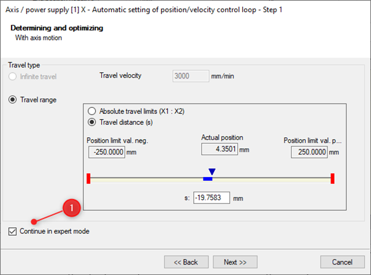
    <figcaption>Continue in Expert Mode</figcaption>
</figure>

**Do not** optimize position controller and frequency response.
**Do not** optimize  acceleration feedforward.
<figure>
    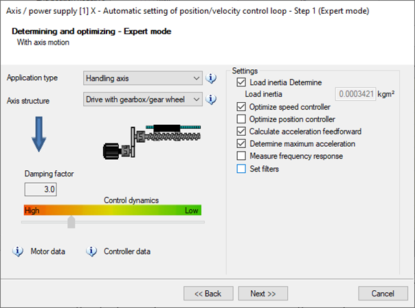
    <figcaption>Select Handling and parameters to set</figcaption>
</figure>
 
Afficher les résultats et commenter

> Comparer Load Inertia : *your measure* avec celle du moteur ``P-0-0510``.
Votre commentaire…

Essayer avec Feed-Forward et comparer

# Frottement dynamique
-   Mesurer la force nécessaire a faible vitesse constante
-   Utiliser le mode **Velocity Control**, mais sur +- 50 mm pour faire cette mesure, augmenter le temps de mesure sur la trace
-   Faire des mesures à 600 mm/min
-   Puis 1200, 1800 et 2400…6000 (soit 100 mm/s)

    Comparer avec les spécifications du moteur.

Utiliser click droit pour visualiser les données :
<figure>
    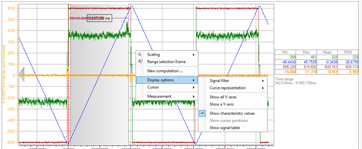
    <figcaption>Show characteristic values</figcaption>
</figure>

# Frottement statique.
-   Mesurer la force nécessaire pour vaincre le frottement statique.
    Pour ceci, utiliser le mode **Torque/Force Control** et augmenter **petit à petit** les % de la commande de force.

	Comparer avec les spécifications du moteur.

# En finalité
## Préparer un mouvement avec
$\ +/- 50 [mm]$ avec une vitesse de $\ 6000 [mm/min]$ et une accélération de 1 $\ m/s^2 $.
-   La force en rouge
-   La vitesse en bleu
-   La position en vert
-   L'erreur de vitesse en noir

## Proposer votre tunning idéal, le justifier et le commenter
Sachant que:

|Overshoot à éviter|Mieux !|
|-----------|--------------|
|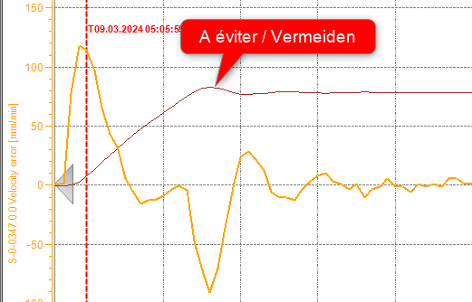|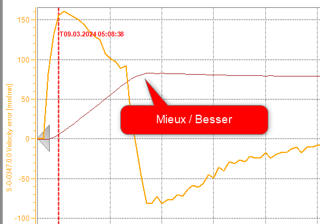|

# Questions auxiliaires
-   Quels est la tension sur le bus DC ?
-   Quels sont les registres que le PLC envoie au drive?
-   Quel registre permet au PLC de connaitre la position du moteur ?
-   Pourquoi est-il, dans notre cas, inutile de configurer le codeur ?
-   Combien de points par tour le moteur de l'axe X reçoit-il via le bus Ethercat lorsque la limite de vitesse de l'axe X est atteinte ?
-   Expliquer pourquoi le moteur de l'axe X semble surdimensionné par rapport au couple maximal admissible par la vis à billes.
-   A quoi sert le frein sur l'axe Z ?

# Ne pas quitter la salle avant d'avoir restauré les paramètres !
