<h1 align="left">
   
  
   
  HEI-Vs Engineering School - Industrial Automation Base
   
</h1>

Cours AutB

Author: [Cédric Lenoir](mailto:cedric.lenoir@hevs.ch)

# LAB 05 (Fortsetzung)
## Inbetriebnahme einer elektrischen Achse mit Kugelumlaufspindel.

Job starts with:

# CtrlX Drive Engineering
Diese Software wurde entwickelt, um:
- Parameter der elektrischen Achsen einsehen und ggf. ändern.
- Visualisieren Sie das Verhalten der Achse mithilfe eines integrierten Oszilloskops.
- Steuern Sie die Achse im manuellen Modus, um ihr Verhalten zu optimieren.
- Starten Sie einen **Auto-Tuning**-Vorgang.

<figure>
    
    <figcaption>Use CtrlX Drive Engineering</figcaption>
</figure>

# Connect

Schließen Sie das Laufwerk über USB-C an und verwenden Sie die X-Achse. Möglich ist dies, indem Sie Ihren eigenen PC verwenden, um den Labor-PC für andere Aufgaben freizuhalten.
 
 

<figure>
    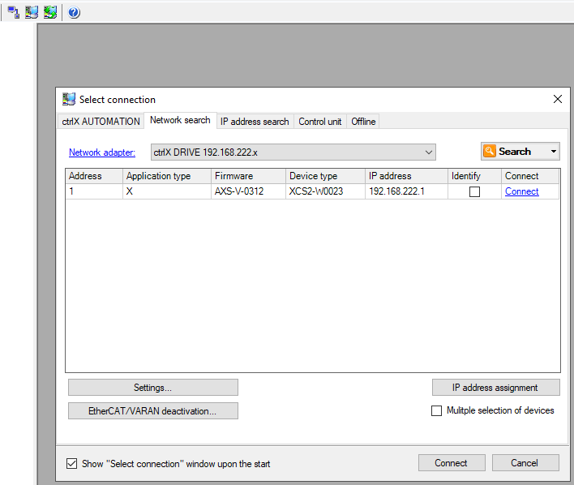
    <figcaption>Connection to drive with USB-C</figcaption>
</figure>

> Es ist möglich, auf verschiedene Arten eine Verbindung herzustellen.

# Backup
Sichern Sie die aktuellen Einstellungen, damit Sie sie bei Bedarf wiederherstellen können.

Vor dem Speichern der Parameter wechseln Sie am besten in den PM-Modus, den Parametermodus. Dazu darf der Motor spannungsfrei sein.

SelectParameterMode

<figure>
    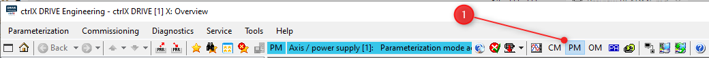
    <figcaption>Set Axis in PM, Parameter Mode</figcaption>
</figure>
 
<figure>
    
    <figcaption>Save a backup of drive parameters to restore them if needed</figcaption>
</figure>

Die Parameter sind nach dem [Sercos](https://www.sercos.org)-System nummeriert.
Auf eine Vielzahl von Parametern kann in Echtzeit oder Nicht-Echtzeit, lesend oder schreibend, zugegriffen werden. Bestimmte Parameter können nur geändert werden, wenn der Motor kein Drehmoment mehr hat oder sich der Antrieb im Parametermodus befindet.

- **Sicherungsparameter** für Konfigurationsparameter.
- **Alle Parameter**, archiviert absolut alle Parameter. Dies ist nützlich, um eine Diagnose zu stellen oder im Rahmen eines Kurses eine Achse nur in Form von Parametern darzustellen.

Stellen Sie nach dem Archivieren der Einstellungen den OM-Modus wieder her.

<figure>
    
    <figcaption>Restore OM Operating Mode</figcaption>
</figure>

# Scaling
Um die Encoderposition in anwendungsgerechte Einheiten umrechnen zu können, muss die Achse die mechanischen Parameter des Systems kennen.

In unserem Fall wird die Position des Encoders unter anderem in mm für die lineare Position der X-Achse umgerechnet.

<figure>
    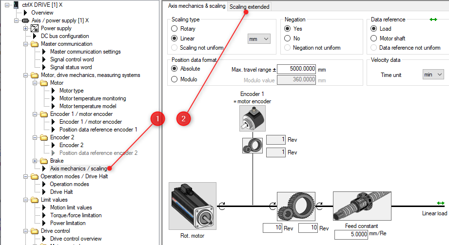
    <figcaption>Go to Axis Mechanical Scaling</figcaption>
</figure>

Um die Ergebnisse leichter interpretierbar zu machen, ändern wir einen Parameter, sodass das System das Motordrehmoment in eine Kraft umwandelt, um die lineare Kraft am Ausgang der Kugelumlaufspindel abzulesen. **Vorsicht mit der Geschwindigkeit**, hier arbeiten wir in $\ [m/s]$.

<figure>
    
    <figcaption>Change scaling to force</figcaption>
</figure>

Es ist zu beachten, dass ein Wechsel der Einheit unter keinen Umständen möglich ist. Die Achse muss sich im **CM**-Modus, **Configuration Mode**, befinden, um eine Änderung der Einheit zuzulassen.

<figure>
    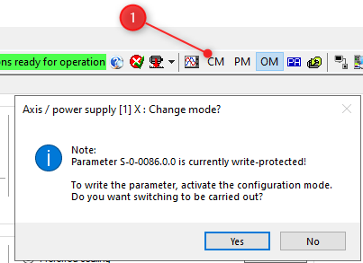
    <figcaption>You must be in Configuration Mode to modify a scaling parameter</figcaption>
</figure>

## Grenzen ändern
Das System weiß nicht, wie Grenzwerte beim Ändern der Einheit von Drehmoment in Kraft korrekt umgerechnet werden.
Sie müssen die Kraftgrenzen ändern, sonst können Sie die Achse nicht verwenden!

<figure>
    
    <figcaption>Display some parameters used for this lab</figcaption>
</figure>

Sie können die Liste der anzuzeigenden Parameter speichern. Dateityp ipg.
Sie können auch die mit den Dokumenten bereitgestellte Datei verwenden, siehe: ``..\ctrlxDriveFiles\WatchListForTuning.ipg``.

Sie können die Grenzwerte entweder in dieser Parameterliste ändern. Seien Sie vorsichtig, Sie müssen sich im **PM**-Modus befinden.
Gehen Sie entweder zu dem in der Einleitung erwähnten Limitfenster.

### Les limites à modifier
-   ``P-0-0109.0.0 ``   :   1766
-   ``S-0-0082.0.0``    :   1500
-   ``S-0-0083.0.0``    :   -1500

> Das System führt bei einem Einheitenwechsel keine automatische Kraft-/Stärkeumrechnung an den Grenzen durch, weshalb diese Grenzen bei einem Einheitenwechsel angepasst werden müssen.

> Wenn diese Grenzwerte zu niedrig sind, kann das System insbesondere in Beschleunigungs- und Verzögerungsphasen nicht richtig arbeiten.

> Umgekehrt besteht bei zu hohen Grenzwerten die Gefahr einer Beschädigung der Mechanik.

Berechnen Sie die maximale theoretische Kraft der Kugelumlaufspindel.
Zur theoretischen Kraft müsste man den Wirkungsgrad der Kugelumlaufspindel multiplizieren, der **schätzungsweise zwischen 0,5 und 0,9 liegt**. Um Ihren Bericht einzureichen.

Wir kennen die Eigenschaften des Kugelgewindetriebs.

|Axe |Smax [mm]|u[mm/U]    |Vmax[m/s]   |amax [m/s2]   |Mmax[Nm] | d  |i   |
|----|---------|-----------|------------|--------------|---------|----|----|
|x   |565      |5.0        |0.3         |15            |**8.22** |ccw |1   |

# Fahren Sie den Motor im manuellen Modus

<figure>
    
    <figcaption>You should be able to move your motor with that</figcaption>
</figure>

<figure>
    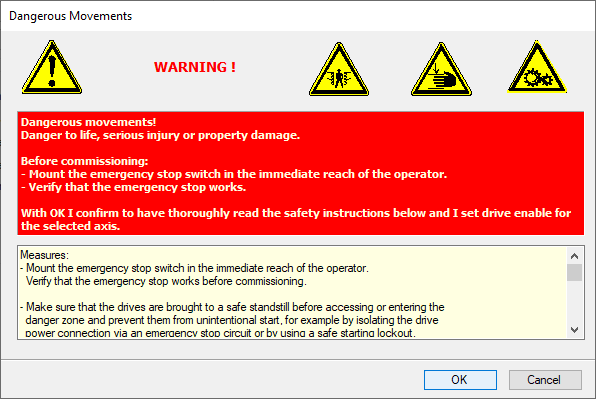
    <figcaption>Only for info, click OK</figcaption>
</figure>

<figure>
    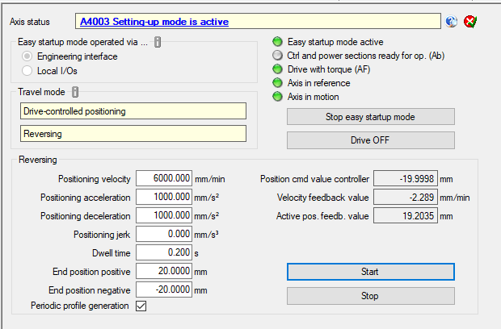
    <figcaption>Start your first motion in Drive Controlled positionning</figcaption>
</figure>

# Trace data
Zeichnen Sie eine klassische Kurve für Position, Geschwindigkeit, Beschleunigung oder Drehmoment und Spurfehler.

<figure>
    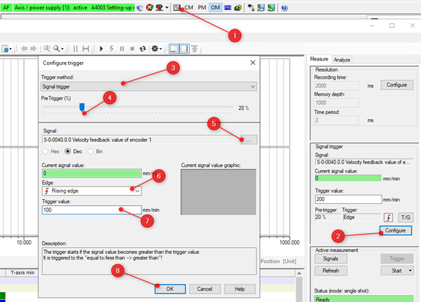
    <figcaption>Trace the motion of Easy Startup Mode</figcaption>
</figure>

## Parameter zum Anzeigen und Kommentieren:
``S-0-0084`` Stärke
``S-0-0051``-Position
``S-0-0040`` Geschwindigkeit
``S-0-0189`` Tracking-Fehler

<figure>
    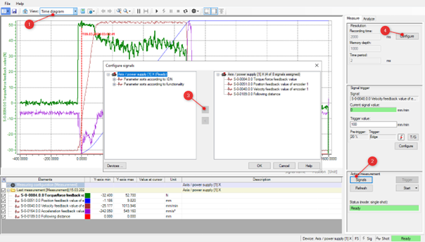
    <figcaption>Configure data to trace</figcaption>
</figure>

<figure>
    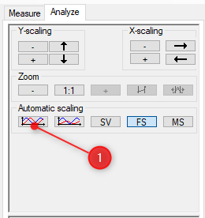
    <figcaption>Scale data</figcaption>
</figure>

# Statische Reibung.
- Messen Sie die Kraft, die zur Überwindung der Haftreibung erforderlich ist.
 Verwenden Sie dazu den Modus **Drehmoment-/Kraftsteuerung** und erhöhen Sie **nach und nach** den Prozentsatz der Kraftsteuerung.

Wie viel Kraft ist ungefähr nötig, um die dynamische Reibung zu überwinden?
 Wie viel Prozent des Motordrehmoments wird für diesen Vorgang verwendet?

> Der Befehl am Eingang des Strom-/Drehmoment-/Kraftreglers entspricht dem Ausgang des hier deaktivierten Geschwindigkeitsreglers.

> Der Tempomat-Integrator macht in gewisser Weise das Gleiche wie Sie. **Es erhöht die Kraft mit der Zeit**. Dies ist einer der Gründe, warum ein Integrator begrenzt ist, da er sonst den Strom am Motor auf unbestimmte Zeit erhöht. Bei einer blockierten Achse erwärmt sich der Motor schnell, dies ist oft ein Zeichen für eine mechanische Blockierung.

# Bei der manuellen Abstimmung handelt es sich um einen Vergleich mit der automatischen Abstimmung.

<figure>
    
    <figcaption>Velocity controller</figcaption>
</figure>

1. Grenzwerte: Ermöglicht Ihnen, die Motorgeschwindigkeit zu begrenzen
2. V-Loop-Filter: 2 oder 4 konfigurierbare Filter + 1 Tiefpassfilter
3. S-0-0100: P-Anteil, proportional zum Tempomat.
4. S-0-0101: Komponente I, Tempomatintegral.
5. S-0-0163: Gewichtskompensation, für Vertikalachsen

<figure>
    
    <figcaption>Velocity controller transfer function</figcaption>
</figure>

## Verfahren
### Empirisches Setting
Basierend auf der Ziegler- und Nichols-Methode

> Lassen Sie den Motor idealerweise im Drehzahlmodus mit etwa 20 U/min im **Easy Startup Mode** laufen. Wenn die Mechanik es nicht zulässt, arbeiten Sie im Stillstand. **Da wir ein lineares System mit endlicher Grenze haben, arbeiten wir mit einer Geschwindigkeit von Null**.

> Achtung, Feed-Forward; ``P-0-1126.0.0 ``auf 0!

### Verstärkung S-0-0100
> Abreisebedingungen:
- Lageregler ``S-0-0104`` = 1
$$\ S-0-0100 = 1000 * Motorträgheit = 1000 * P-0-0510 $$
- ``S-0-0101`` = 0 [ms] ohne Integrator
- ``P-0-0510`` = 0,0001600

> Also start mit ``S-0-0100`` = **0,16**

Erhöhen Sie die Verstärkung **allmählich**, bis das System zu vibrieren beginnt.

Grundsätzlich ist die Vibration hörbar, ansonsten sehen Sie sich das Signal ``S-0-0100`` auf dem Oszilloskop an.

<figure>
    
    <figcaption>Velocity controller vibration</figcaption>
</figure>

- Verringern Sie die Verstärkung, bis die Vibration aufhört. Das ist der entscheidende Gewinn.
- Teilen Sie den kritischen Gewinn durch 2.

#### Beispiel :
- Startverstärkung: S-0-0100 = 1000 * P-0-0510 = 0,01
- Die Schwingung erscheint bei 0,09 und verschwindet bei 0,065. Der kritische Gewinn beträgt 0,065
- S-0-0100 geschätzt auf 0,065 / 2 = 0,0325

### Integrationszeit S-0-0101
-   Verringern Sie die Integrationszeit S-0-0101 schrittweise (beginnend bei ca. 100 ms), bis Sie den Oszillationspunkt erreichen.
-   Erhöhen Sie die Integrationszeit, bis die Schwingung aufhört. Der erhaltene Wert ist die kritische Zeit.
-   Anschließend multiplizieren Sie den Wert mit 2, um den Endwert von S-0-0101 zu erhalten.

#### Beispiel :
Startzeit: ``S-0-0101`` = 100 ms
Die Schwingung erscheint bei 0,6 und verschwindet bei 0,7. Der kritische Wert liegt bei 0,07
``S-0-0101`` geschätzt auf 0,7 * 2 = 1,4

### Visualisierung mit dem Oszilloskop
Dabei wird das Drehmoment in Rot und die Geschwindigkeit in Blau angezeigt.

<figure>
    
    <figcaption>Velocity controller example on the scope </figcaption>
</figure>

- Die Skalen werden manuell angepasst, um in derselben Tabelle die beiden Werte für eine Drehzahl von 600 U/min anzuzeigen.
- Wir sehen, dass die Drehzahl um weniger als 2 U/min < 0,5 % schwankt.
- Das Drehmoment schwankt mit einem Inkrement der Auflösung
- Wir erhalten somit einen stabilen Drehzahlregler für einen einfachen Motor.

## Visualise your data en mode **Velocity Control**,
 
Zeichnen Sie die Kurven über 4 Sekunden für:
- ``S-0-0084`` Stärke
- ``S-0-0051`` Position.
- ``S-0-0040`` Geschwindigkeit
- ``S-0-0189`` Tracking-Fehler

Start und automatische Skalierung bei Signalverfügbarkeit

> Kommentieren Sie die Grafik

## Vergleichen Sie mit Autotuning
Merken Sie sich Ihre Werte von ``S-0-0100`` und ``S-0-0101`` und vergleichen Sie diese mit der automatischen Abstimmung.

<figure>
    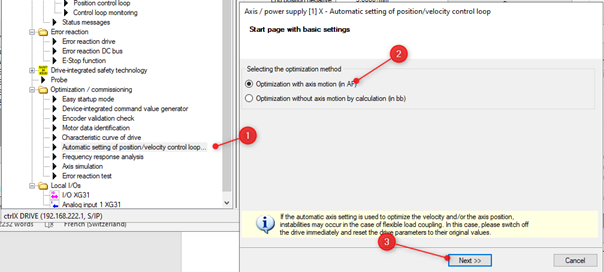
    <figcaption>Start Auto-Tuning </figcaption>
</figure>

 
Konfiguriert ohne Feed-Forward und ohne Filter.

<figure>
    
    <figcaption>Continue in Expert Mode</figcaption>
</figure>

**Do not** optimize position controller and frequency response.
**Do not** optimize  acceleration feedforward.

<figure>
    
    <figcaption>Select Handling and parameters to set</figcaption>
</figure>

 
Ergebnisse ansehen und kommentieren

> Vergleichen Sie die Lastträgheit: *Ihr Maß* mit dem des Motors „P-0-0510“.
Dein Kommentar…

Versuchen Sie es mit Feed-Forward und vergleichen Sie

# Dynamische Reibung
- Messen Sie die erforderliche Kraft bei niedriger konstanter Geschwindigkeit
- Verwenden Sie den Modus **Antriebsgesteuerte Positionierung**, aber erhöhen Sie bei +- 50 mm die Messzeit auf der Spur, um diese Messung durchzuführen.
- Messungen mit 600 mm/min durchführen
- Dann 6000 mm/min (also 100 mm/s)

> Es wäre besser, den Geschwindigkeitsmodus zu verwenden, aber dieser hat derzeit einen **Fehler** und bewegt sich auf einigen Maschinen nicht hin und her.

Klicken Sie mit der rechten Maustaste, um die Daten anzuzeigen:

<figure>
    
    <figcaption>Show characteristic values</figcaption>
</figure>

# Letzten Endes

> Sie können die im Anhang bereitgestellten PLC- und Node-RED-Programme verwenden, um den Betrieb in den Zuständen **Auto** und **Execute** zu überprüfen.

## Bereiten Sie eine Bewegung mit vor
$\ +/- 50 [mm]$ mit einer Geschwindigkeit von $\ 0.04 [m/s]$ und einer Beschleunigung von $\ 1 [m/s^2] $.
- Stärke in Rot
- Geschwindigkeit in Blau
- Die Position in Grün
- Geschwindigkeitsfehler in Schwarz

## Schlagen Sie Ihr ideales Tuning vor, begründen Sie es und kommentieren Sie es
Wissend, dass:

|Zu vermeidendes Überschwingen|Besser!|
|-----------|--------------|
|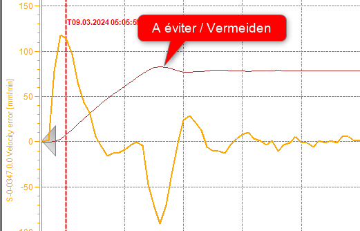||

## Hilfsfragen
- Wie hoch ist die Spannung am DC-Bus?
- Welche Register sendet die SPS an den Antrieb?
- Welches Register ermöglicht es der SPS, die Position des Motors zu erkennen?
- Warum ist es in unserem Fall unnötig, den Encoder zu konfigurieren?
- Wie viele Punkte pro Umdrehung erhält der X-Achsen-Motor über den Ethercat-Bus, wenn die X-Achsen-Geschwindigkeitsgrenze erreicht ist?
- Erklären Sie, warum der X-Achsen-Motor im Vergleich zum maximal zulässigen Drehmoment der Kugelumlaufspindel überdimensioniert erscheint.
- Wozu dient die Bremse an der Z-Achse?

## Verlassen Sie den Raum nicht, bis Sie die Einstellungen wiederhergestellt haben!

## Nach dem Laden der Parameter den Antrieb wieder in den **OM**-Modus, Operating Mode, versetzen!